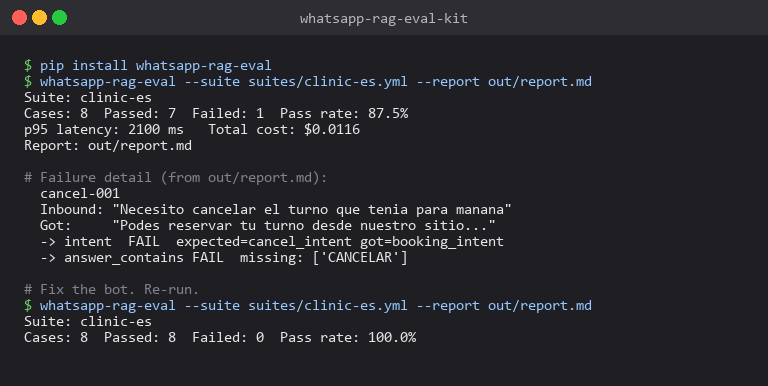
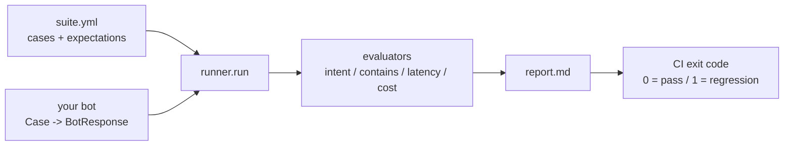

# whatsapp-rag-eval-kit

[](https://github.com/sarteta/whatsapp-rag-eval-kit/actions/workflows/tests.yml)
[](https://www.python.org)
[](./LICENSE)

YAML-driven evaluation harness for WhatsApp RAG bots. Catches the failure modes that matter in production: wrong intent, missing information, hallucinated phrases, slow replies, blown token cost.





Existing eval tools focus on long-form QA. WhatsApp conversations are short turns with intent tags, Spanish/Portuguese, and cost per conversation. This kit handles those.

## What it does

You write a YAML file of inbound messages + what you expect the bot to
do. The kit runs your bot against each case, checks every expectation,
and writes a Markdown report you can paste into Slack / Notion / a
customer email.

```yaml
# suites/clinic-es.yml
cases:
  - id: cancel-001
    inbound: "Necesito cancelar el turno que tenia para manana"
    expect:
      intent: cancel_intent
      answer_contains: ["CANCELAR"]
      max_latency_ms: 2000
      max_cost_usd: 0.01
```

Run:

```bash
pip install -e .
whatsapp-rag-eval --suite suites/clinic-es.yml --report out/report.md
```

Output:

```
Suite: clinic-es
Cases: 8  Passed: 7  Failed: 1  Pass rate: 87.5%
p95 latency: 2100 ms   Total cost: $0.0116
Report: out/report.md
```

Exit code is non-zero if any case fails, so this works in CI as a
regression gate for your bot.

See [`examples/example-report.md`](./examples/example-report.md) for a
rendered sample report (a real run where one case fails -- that's the
failure detail section showing exactly what went wrong).

## Checks it runs

Each case can declare any of these. Unspecified checks are skipped.

| Check | Expectation | Failure example |
|-------|-------------|-----------------|
| `intent` | exact match vs tag your bot emits | `expected=cancel_intent got=booking_intent` |
| `answer_contains` | all listed substrings, case-insensitive | `missing: ['lunes']` |
| `answer_does_not_contain` | none of the listed substrings may appear | `banned phrase present: ['no sé']` |
| `max_latency_ms` | observed latency ≤ cap | `2400ms (cap 2000ms)` |
| `max_cost_usd` | observed cost ≤ cap | `$0.0180 (cap $0.0100)` |

The `does_not_contain` check catches the "confidently makes up" failure mode where the bot invents schedule info or prices that are not in the knowledge base.

## Wiring your own bot

The kit ships with a deterministic mock bot so you can try everything
without an LLM provider. To evaluate your real bot, pass a callable of
type `Case -> BotResponse` into `runner.run()`:

```python
from whatsapp_rag_eval import loader, runner
from whatsapp_rag_eval.evaluators import BotResponse
from whatsapp_rag_eval.loader import Case

def my_bot(case: Case) -> BotResponse:
    # call your Twilio + Claude + pgvector stack here
    answer, intent, latency_ms, cost_usd = your_stack(case.inbound)
    return BotResponse(
        case_id=case.id,
        answer=answer,
        intent=intent,
        latency_ms=latency_ms,
        cost_usd=cost_usd,
    )

suite = loader.load("suites/clinic-es.yml")
result = runner.run(suite, my_bot)
```

No network calls happen from inside the kit. Everything that talks to
your LLM or your retriever is in _your_ `my_bot` function. Keeps eval
cost predictable and CI runs fast.

## Roadmap

- [ ] LLM-as-judge evaluator for free-form answer quality (the existing
      checks are deterministic -- the judge mode would add qualitative
      grading with a rubric)
- [ ] HTML report with charts (per-intent accuracy, latency histograms)
- [ ] Golden-answer regression mode (diff vs last run, show only what
      regressed)
- [ ] Multi-language suite loader (PT-BR sibling of the ES examples)

## Design notes

- Checks return early on skip (`None`) so the report surfaces only what
  the author asked for. Zero noise from undeclared expectations.
- Every check reports a human-readable `detail` string. The report has
  to be something a non-technical owner can read and act on.
- Deterministic mock bot is seeded by case id, so CI output is
  reproducible. No flaky tests on the eval framework itself.

## License

MIT © 2026 Santiago Arteta
